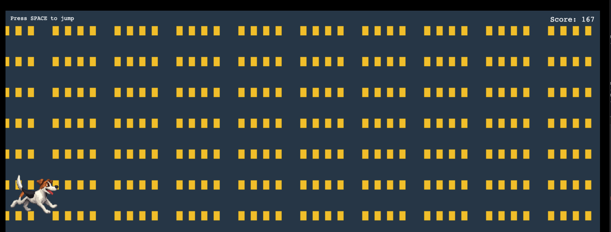

# Phaser React Game

A 2D scrolling game built with Phaser 3, React, and Vite. The game features a procedurally generated cityscape background and a character that can jump over obstacles.

## Screenshot



## Features

- Procedurally generated scrolling cityscape background, The cityscape background is coming, my image generation skills were bad and slow, even bought tokens
- Smooth player jumping mechanics with gradual height control
- Score system that increases over time
- Responsive game canvas that adapts to window size
- Modern development setup with Vite and TypeScript

## Getting Started

1. Clone the repository:

   ```bash
   git clone https://github.com/John-MacAulay/CursorGameExp.git
   cd CursorGameExp
   ```

2. Install dependencies:

   ```bash
   npm install
   ```

3. Start the development server:
   ```bash
   npm run dev
   ```

## Game Mechanics

- Press SPACE to make the player jump
- The jump height is controlled by a gradual rise system
- The background automatically scrolls from right to left
- Score increases automatically as you play
- The game canvas automatically resizes with the window

## Technical Details

This project uses:

- Phaser 3 for game development and physics
- React for UI components and game container
- Vite for fast development and building
- TypeScript for type safety
- Procedural generation for the background
- Custom jump mechanics with gravity simulation

## Development

The project structure:

- `src/components/Game.tsx` - Main game component
- `src/scenes/GameScene.ts` - Game logic and mechanics
- `public/assets/` - Game assets directory

## License

This project is licensed under the MIT License - see the LICENSE file for details.
